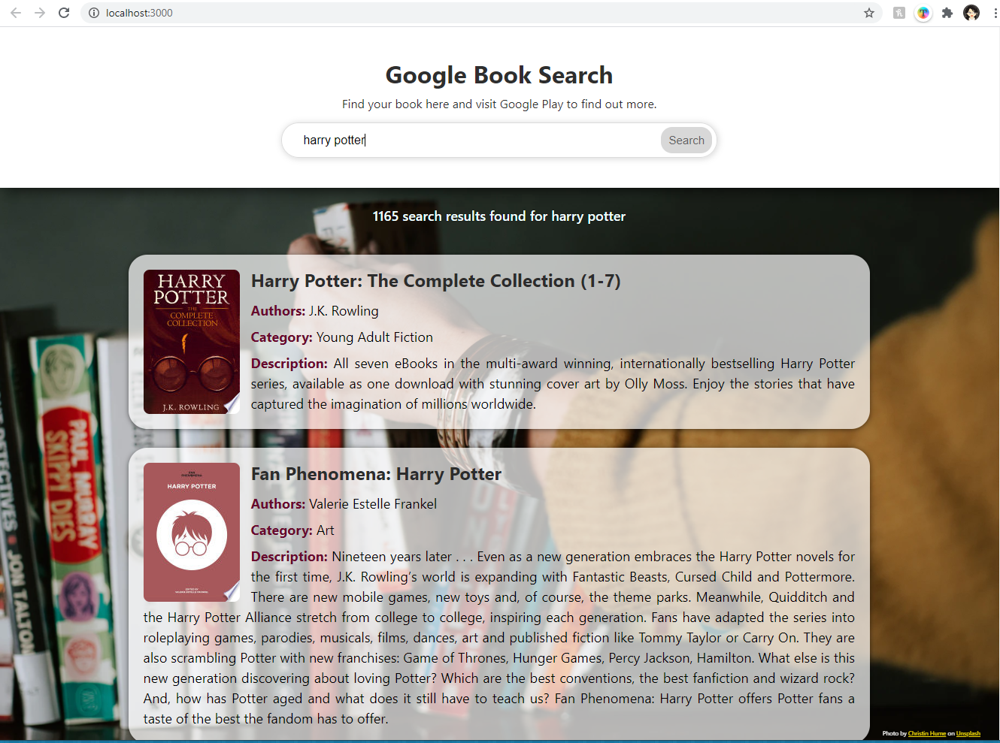

# Book Finder App
###### Find your favorite book, written in React, Axios (Promise based HTTP client), GoogleApi



**Demo:** https://hengameh.github.io/react-book-finder-app/

This project was bootstrapped with [Create React App](https://github.com/facebook/create-react-app).

## Overview
Here you can find my responsive React book finder app requirements which easily created with no build configuration ([Creating an App](https://github.com/facebook/create-react-app#creating-an-app))

1. This app will display a list of books, based on what users search for
2. Display a text input, pre-populated with a value, like "harry potter".
3. When the app loads, it will automatically fetch for a list of books based on the value inside of the text input.
4. The list of books should display the name of the book and a description for each item. Also make sure to display it's categories. If available, display the thumbnail of the book as well.
5. Clicking on the title of the book should take you to the external book page.
6. Allow users to search for different books. Feel free to add a "Search" button.
7. Once users try to search for new books, reload the items of the page with items that match the current search term.
8. If no results are found, display a proper message: "no books found for '12345678987654326765'".
9. While the book list loads, display a loading message or spinner.

### Here's an example request for books with the term "harry potter"

```GET https://www.googleapis.com/books/v1/volumes?q=harrypotter```

**Note:** Like always make sure to break down this project into steps rather than trying to do everything at once. Enjoy!

Photo by [Christin Hume](https://unsplash.com/@christinhumephoto?utm_source=unsplash&utm_medium=referral&utm_content=creditCopyText) on [Unsplash](https://unsplash.com/?utm_source=unsplash&utm_medium=referral&utm_content=creditCopyText)

Licensed under the [MIT License](LICENSE)
____________________________________________________________________________

## How to run this project locally

In the project directory, you can run:

### `npm install`
Install the dependencies in the local node_modules folder.

### `npm start`

Runs the app in the development mode.<br />
Open [http://localhost:3000](http://localhost:3000) to view it in the browser.

The page will reload if you make edits.<br />
You will also see any lint errors in the console.

